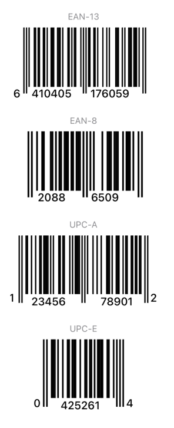

# BarcodeToolsKit

Work in progress library for providing additional barcode tools for Swift and SwiftUI

### Features

| Symbology | Validation | View | Scanner |
| --------- | ---------- | ---- | ------- |
| EAN-8     | ✅         | ✅   | ✅      |
| EAN-13    | ✅         | ✅   | ✅      |
| UPC-A     | ✅         | ✅   | ✅      |
| UPC-E     | ✅         | ⚠️   | ✅      |

### Example

Generate views from barcodes

```swift
import SwiftUI

struct ContentView: View {
    var body: some View {
        VStack(spacing: 20) {
            VStack {
                Text("EAN-13")
                    .font(.caption)
                    .foregroundColor(.secondary)
                BarcodeView(barcode: "6410405176059")
                    .frame(width: 200, height: 100)
            }

            VStack {
                Text("EAN-8")
                    .font(.caption)
                    .foregroundColor(.secondary)
                BarcodeView(barcode: "20886509")
                    .frame(width: 200, height: 100)
            }

            VStack {
                Text("UPC-A")
                    .font(.caption)
                    .foregroundColor(.secondary)
                BarcodeView(barcode: "123456789012")
                    .frame(width: 200, height: 100)
            }

            VStack {
                Text("UPC-E")
                    .font(.caption)
                    .foregroundColor(.secondary)
                BarcodeView(barcode: "04252614")
                    .frame(width: 150, height: 100)
            }
        }
    }
}
```



Scan a barcode

```swift
import SwiftUI

BarcodeScannerView(onDataFound: { barcode in print(barcode) })
```
