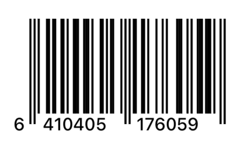
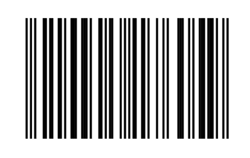

# BarcodeToolsKit

BarcodeToolsKit provides additional tools for working with barcodes with SwiftUI. It provides a way to validate barcodes and render those using SwiftUI canvas. It also provides a scanner that is limited to scanning the supported barcode types.

Currently supported types include EAN-8, EAN-13, UPC-A and UPC-E.

## Installation

Install using SPM

```
dependencies: [
    .package(url: "https://github.com/villeheikkila/BarcodeToolsKit", from: "1.0.0"),
],
targets: [
    .target(name: "MyTarget", dependencies: [
        .product(name: "BarcodeToolsKit", package: "BarcodeToolsKit"),
    ]),
]
```

Import where needed

```swift
import BarcodeToolsKit
```

## Requirements

- Swift 6.0+
- iOS/iPadOS/tvOS 17+, watchOS 9, macOS 12+, visionOS 1+

### Usage

### View

Generate a barcode for a given code, you can also give an optional view that will be used for unsupported unsupported or malformatted codes

```swift
BarcodeView(barcode: "6410405176059") {
    ContentUnavailableView(
        "Unsupported Barcode Type",
        systemImage: "barcode"
    )
    .symbolVariant(.slash)
}
.barcodeStyle(.plain)
.barcodeLineColor(.black)
```

You can optionally specify the barcode style and color

Default Style



Plain Style



### Scan a barcode

```swift
BarcodeScannerView {
    barcode in print(barcode)
}
```
